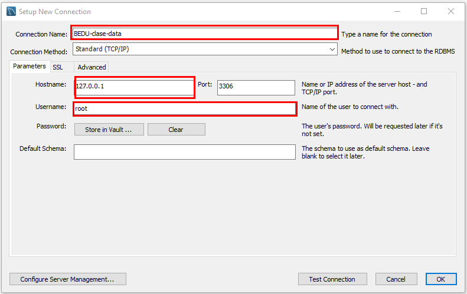

# Introducción
En esta primera sesión conoceremos los conceptos básicos de las bases de datos relacionales mediante la conexión a una base de datos. Revisaremos cuáles son los componentes de una tabla y cómo extraer información de la misma a través de consultas definidas en un lenguaje (SQL).

> Nota: Para el desarrollo de este curso debe de tener instalado MySQL Workbench. 
> https://bedu.org/blog/tecnologia/instalacion-base-de-datos/

# ¿Cómo conectarse a MySQL?
Para conectarnos a MYSQL existen tres formas:
 1. Desde línea de comandos con mycli
 2. Desde línea de comandos con MySQL Workbench
 3. Con la herramienta de MySQL Workbench

### 1. Conexión desde línea de comandos con mycli
Con ayuda de la herramienta en python llamada **"mycli"** podemos revisar desde la línea de comandos con la siguiente instrucción:
```bash
Sintaxis:
mycli -u <usuario> -h <host>  <endpoint> -p <password>

Ejemplo:
mycli -u root -h ec2-52-12-20-255.us-west-2.compute.amazonaws.com -p '*9ak/oVTwtY_eI:.'
```

Y al presionar enter nos vamos a conectar a la BD, además aparecen unos datos de las herramientas que estamos utilzando para dicha conexión, algo como lo siguiente:
```bash
mysql 8.0.22
mycli 1.22.2
Chat: https://gitter.im/dbcli/mycli
```

Una vez concectado ya podremos realizar comandos de SQL en la herramienta, por ejemplo
```sql
show databases;
use tienda;
```
**Nota:** La ventaja de usar mycli es que tiene una opción de autocompletado, preducción y marcado de texto.

### 2. Conexión desde línea de comandos con MySQL Workbench
Para este modo de conexión ya tenemos que tener instalada la herramienta de MySQL Workbench. Al abirir la terminal escribimos el siguiente comando:

```bash
Sintaxis:
<path de MySQL Workbench> -u <usuario> -h <host>  <endpoint> -p

Ejemplo:
/Applications/MySQLWorkbench.app/mysql -u root -h data-03.bedu.org -p 
```

**Nota:** A diferencia del método de conexión anterior, aquí la opción de "-p" significa que requerimos de un password para entrar a la BD. Entonces al dar enter, aparecerá el mensaje de "Enter password:" en donde escribiremos el password de la BD
Una vez que nos hayamos loggueado, podemos ejecutar comandos de SQL.

### 3. Conexión desde MySQL Workbench
Para crear una nueva conexión al abrir la herramienta de MySQL Workbench, elegimos la opción de crear nueva conexión y aparecerá una ventana como la siguiente:



Solamente ncesitamos llenar los campos de conection name, hostname y username.

# ¿Cómo conectarse a MongoDB?

```bash
Sintaxis:
mongo "mongodb+srv://<usuario><contraseña>@<host>"
Ejemplo:
/Applications/MySQLWorkbench.app/mysql -u root -h data-03.bedu.org -p 
```
Nota: Para el caso de que la contraseña tenga alguno de los siguientes caracteres especiales:
* []
* ?

# Referencias:
1. [Descargar MySQL](https://vimeo.com/481881491)
2. [Formas de conexión en MySQL y MongoDB](https://vimeo.com/482750048)