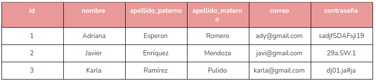

# Terminología Básica
En las bases de datos relacionales existe un vocabulario específico con el objetivo de que las personas dedicadas a esta actividad puedan entender de qué se trata cada uno de los elementos involucrados. A continuación se definen algunos de estos conceptos.

**Dato:** Un dato es considerado la unidad mínima de información. Por sí mismo no provee un significado particular, simplemente es un ente que requiere de una interpretación para dar lugar a la información.

Por ejemplo: 36 o Enchiladas Suizas por sí mismos, son datos cuyo significado desconocemos.

**Información:** Es un conjunto de datos que a través del procesamiento adecuado adquieren un significado en un contexto determinado.

Por ejemplo, en los datos anteriores, 36 es la edad de Mark Zuckerberg y Enchiladas Suizas es la comida favorita de la Abuelita de Batman. Es decir, le estamos dando un significado a los datos y obteniendo información.

**Base de datos:** Es un conjunto de datos con alguna característica en común, puede ser un tema, situación geográfica o algún elemento que los relacione, además de que pueden estar almacenados de manera tradicional (impresos en papel) o en formato digital como un archivo.

Las bases de datos relacionales se basan en el Modelo relacional, propuesto por Edgar F. Codd en los años setenta. Veamos algunos de sus principales elementos más adelante, te presentamos un ejemplo para que puedas observar los elementos de manera más clara):

**Tabla:** Una tabla o relación es una entidad con atributos, campos o columnas y tuplas, registros o renglones. Una tabla representa a un número indefinido de elementos descritos con características en común, cada uno en un diferente renglón.

**Registros:** Los registros, también llamados tuplas o renglones, se refieren a la descripción de cada ente de la tabla. Son instancias particulares, por ejemplo, si tenemos una tabla Persona, un registro contendrá una persona sus datos particulares.

**Campo:** Los campos o atributos se refieren a las columnas de las tablas y representan una característica particular de cada entidad. Por ejemplo para una persona podrían haber campos para el nombre, edad, dirección, etc. Es importante recordar que los campos son comunes a todos los registros de una tabla.

**Dominio:** El dominio se refiere al número de valores que puede obtener una columna, por ejemplo si tuviéramos un campo para almacenar el estado civil, su dominio sería 2 en el caso de tener los valores soltero o casado.

**Cardinalidad:** Es el número de registros que tiene una tabla.

**Grado:** Es el número de campos que tiene una tabla.

## Ejemplo
Veamos un ejemplo para asegurarnos que has comprendido estos conceptos. Tenemos la siguiente tabla que representa un conjunto de usuarios almacenados en una base de datos.

En la tabla anterior, tenemos:

**Seis columnas** que describen a cada usuario, por lo tanto el grado es en efecto 6. Ya que el número de campos de una tabla es el **grado**. En este caso las seis columnas son: id, nombre, apellido_paterno, apellido_materno, correo y contraseña.

Se tienen **tres registros**, que describen a tres usuarios distintos y el dominio del campo id, en este caso es 3, pues tienen tres valores distintos. → id = al número de registros.

Existen varios sistemas que permiten diseñar, crear y administrar en general bases de datos relacionales, este tipo de software recibe el nombre de Sistema Gestor de Bases de Bases de Datos (SGBD). Algunos de los sistemas más populares hoy en día son:

1. [Oracle Database](https://es.wikipedia.org/wiki/Oracle_Database) : SGBD de tipo objeto-relacional 
2. [MySQL](https://es.wikipedia.org/wiki/MySQL) :  SGBD relacional desarrollado bajo licencia dual: Licencia pública general/Licencia comercial por Oracle Corporation y está considerada como la base de datos de código abierto más popular del mundo
3. [MariaDB](https://es.wikipedia.org/wiki/MariaDB) :  SGBD derivado de MySQL con licencia GPL (General Public License). Tiene una alta compatibilidad con MySQL ya que posee las mismas órdenes, interfaces, API y bibliotecas, siendo su objetivo poder cambiar un servidor por otro directamente.
4. [PostgreSQL](https://es.wikipedia.org/wiki/PostgreSQL) : SGBD relacional orientado a objetos y de código abierto
5. [Microsoft SQL Server](https://es.wikipedia.org/wiki/Microsoft_SQL_Server) : SGBD relacional, el lenguaje de desarrollo utilizado es Transact-SQL 
