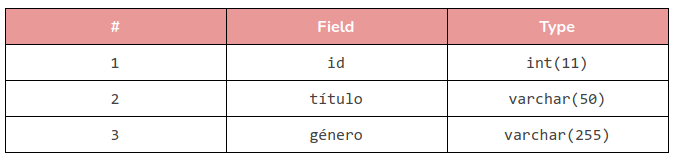
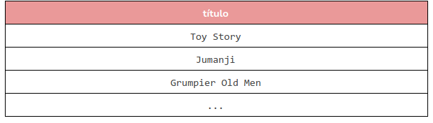
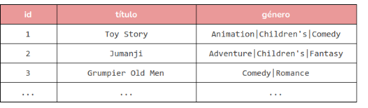
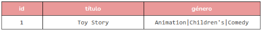
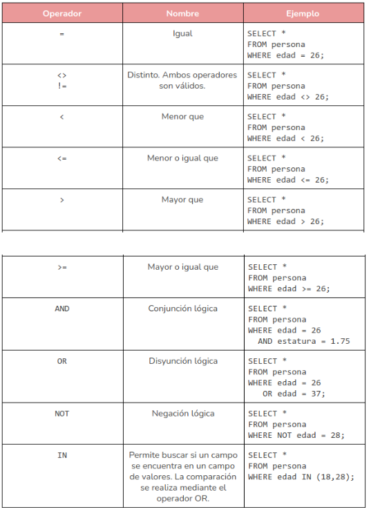

# Trabajo con la BD
Se ven los siguientes temas:
1. Comunicación con la BD
2. Estructura de una Tabla
3. Estructura Básica de una Consulta
4. Ordenamientos y Límites


## Comunicación con la BD
Las bases de datos relacionales, tiene su propio lenguaje, con este nos podemos comunicar con ellas y pedirles que realicen algunas acciones, este lenguaje es llamado SQL y es un estándar para bases de datos relacionales. Cada SGBD tiene su propia implementación de SQL, añadiendo características especiales, pero sigue en general un estándar.

La primera instrucción de SQL que estudiaremos será USE que permite conectarse a una base de datos. Su sintaxis es la siguiente:
```sql
USE <nombre_de_la_base>;
```

Por ejemplo, para conectarnos a la base de datos del inventario del restaurante podríamos escribir algo como:
```sql
USE inventario;
```

Para saber qué bases de datos hay en un servidor, se puede usar el comando:
```sql
SHOW DATABASES;
```

Observa que todas las instrucciones deben terminar con un punto y coma. Esto está diseñado de esa manera pues en SQL pueden definirse pequeños procedimientos que ejecutan varios comandos a la vez y esta es la forma en la que el lenguaje detecta donde termina e inicia una instrucción.

## Estructura de una Tabla
Una vez conectados a la base de datos y dependiendo de cómo esté definida, podremos ver todas las tablas contenidas en la misma, mediante el comando:

```sql
SHOW TABLES;
```

Como mencionamos antes, una tabla se conforma de un conjunto de columnas que describen cada registro que se almacena en la misma. Para conocer los campos de una tabla, puede usarse el comando DESCRIBE que muestra los campos de la misma y el tipo de dato a almacenar.
```sql
DESCRIBE <nombre_tabla>;
```

Por ejemplo, supongamos que existe en una base de datos, la tabla movies. Al ejecutar el comando DESCRIBE sobre la misma, podríamos obtener un resultado como:
```sql
DESCRIBE movies;
```


En realidad, MySQL arroja más resultados cuando realizamos una operación DESCRIBE. Sin embargo, hasta este punto basta con que analicemos estos dos campos.

El resultado de la descripción, nos indica que la tabla incluye tres campos: id, título y género y nos muestra el tipo de dato que almacena cada uno. Los tipos de datos nos permiten manipular de forma más eficiente los datos almacenados, por ejemplo, si tenemos un campo numérico, esto facilitará que podemos hacer alguna operación aritmética con ella.

En nuestro ejemplo se muestran dos tipos de datos: int y varchar que indican que cada campo almacena números enteros y cadenas de caracteres respectivamente.

Para conocer más de los tipos de datos que se le asignan a una columna, puedes consultar la documentación de MySQL: (Data Types)[https://dev.mysql.com/doc/refman/8.0/en/data-types.html].

## Estructura Básica de una Consulta
Ahora que sabemos cómo está definida la estructura de una tabla podemos obtener los registros que tiene. Para hacer esto, haremos uso de la instrucción SELECT que permite obtener registros de una tabla a partir del nombre de los campos y de la tabla. A continuación se muestra la estructura de un SELECT en su forma más básica.

```sql
 SELECT <campo1>, <campo2>, …
 FROM <tabla>;
```

Esta estructura permite seleccionar (algunos autores lo llaman proyectar) los registros. La primera parte, indica los campos que se mostrarán, separados por comas. Por otro lado la parte indica la tabla de la cual tomaremos los datos.

Por ejemplo, supongamos que queremos visualizar los registros almacenados en la columna título de la tabla movies, tendríamos que escribir la instrucción:

```sql
 SELECT titulo
 FROM movies;
```



Este tipo de instrucciones recibe el nombre de “consulta” pues como su nombre lo indica, se realiza una consulta de los registros que hay en la tabla correspondiente.

Observa que los resultados de una consulta siempre se muestran en una tabla, aún cuando sólo contengan un único registro. Si quisiéramos traer todos los campos de una tabla, pueden reemplazarse los nombres de las columnas por un asterisco, por ejemplo:

```sql
 SELECT *
 FROM movies;
```


También podemos aplicar filtros a los resultados con el fin de facilitar la búsqueda de datos. Por ejemplo, supongamos que queremos los datos de aquellos registros cuyo nombre es “Toy Story”.

Para filtrar resultados se añade la restricción WHERE a la consulta, por ejemplo:

```sql
SELECT *
FROM movies
WHERE titulo = ‘Toy Story’;
```


Con WHERE podemos utilizar operadores relacionales, lógicos y algunos otros de utilidad con el fin de hacer combinaciones de filtros. La siguiente tabla muestra algunos de estos operadores. Es importante que los identifiques y comprendas ya que son los caracteres que te van a permitir realizar operaciones matemáticas, concatenar cadenas y hacer comparaciones. 



## Ordenamientos y Límites
Otras restricciones que pueden aplicarse a las consultas son ORDER BY y LIMIT. La primera le indica a la consulta la forma en que debe mostrar los datos, ordenando los mismos por un campo de forma ascendente (ASC) o descendente (DESC). Por defecto, los resultados siempre son ordenados de forma ascendente. La segunda restricción, indica el número de registros máximo que traerá la consulta.

Por ejemplo, la siguiente consulta, ordena los resultados por el campo edad de forma descendente y limita los registros a 3.

```sql
SELECT *
FROM persona
WHERE estatura = 1.75
ORDER BY edad DESC
LIMIT 3;
```
Por otro lado las siguiente consulta, ordenan de forma ascendente. Son equivalentes.

```sql
SELECT *
FROM persona
WHERE estatura = 1.75
ORDER BY edad
LIMIT 3;

SELECT *
FROM persona
WHERE estatura = 1.75
ORDER BY edad ASC
LIMIT 3;
```