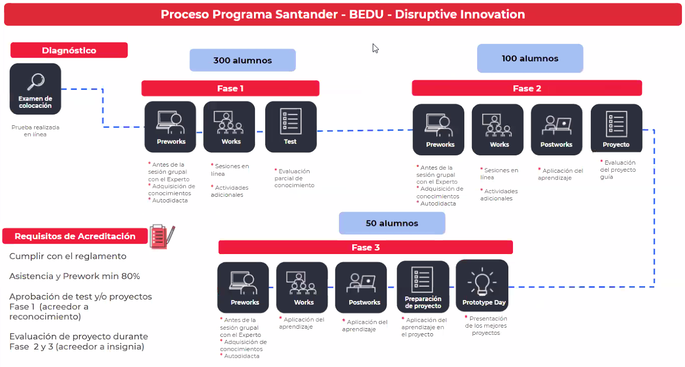

# Sesión 06-mayo-21
Modelo educativo: Blended learning
--> Combinación de aprendizje asíncrono y sinróno

# Políticas de acreditación
1. Reglamento
2. Asistencia 80% y puntualidad
3. Prework 80% 
4. Evaluaciones
    1. Fase 1: Aprobación test 
    2. Fase 2 y 3: Presentación de proyecto 