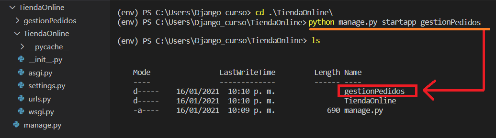

# Base de Datos
Recordemos que el modelo con el  que trabaja Django es **MTV**, que significa:
* Model: Es la demanda y envío de datos
* Template: Es todo aquello con lo que interactúa el usuario, como por ejemplo, plantillas html
* View: Son las funciones con las que van a trabjar las plantillas 

Los gestores de BD con los que trabaja Django oficialmente son:
* SQLite3: Gestor de BD por defecto
* PostgreSQL: Gestor recomendado
* MySql
* Oracle

En esta primera parte vamos a trabajar con el gestor **SQLite3**

---
## Proyecto vs Aplicación
Django hace una distinción clara entre estos dos conceptos. 

* La aplicación forma parte de un proyecto, por lo que **SIEMPRE** va a estar en un proyecto. Podemos ver a las aplicaciones como una especie de módulo que hace una tarea concreta o una suma de tareas concretas.

* Un proyecto, dependiendo de su complijidad va a tener ninguna/una/muchas aplicaciones.

**Ejempllo:** Imaginemos que vamos a crear una tienda online. Entonces el proyecto será la tienda en sí y sus aplicaciones pueden ser:
* Aplicación 1: Gestón del panel de control, desde el cual manejar todo el stock, los clientes, las ventas que hemos hecho, el dinero que hemos ingresado, etc.
* Aplicación 2: Gestión del stock del almacén, indicará cuántos artículos quedan, cuántos necesito, si tengo suficientes artículos o no para pasar el día o el mes.
* Aplicación 3: Gestione los pagos, si los clientes pagan con tarjeta, vía paypal, transferencia electrónica, etc.

Una gran ventaja que tiene esta estructura de proyecto-aplicación es la reutilización/modularización de código, porque si en un futuro tienes otro ptoyecto parecido, puedes retulizar una aplicación que ya desarrollaste anteriormente. 

Por ejemplo, después de trabajar con este proyecto de tienda online trabajas con otro proyecto para gestionar un almacén. 
Y se necesita una aplicación para este proyecto que maneje el stock del almacén, entonces podrías reutilizar la aplicación de gestión del stock del proyecto de la tienda online para este nuevo. 

---
## Creación de la bd (teoría)
La BD  al ser SQLite3 la crea por default Django, entonces no tenemos que crearla explícitamente.

---
## Creación de las tablas (teoría)
En Django utilizamos la clase **model**, que nos permite crear tablas, eliminar tablas, crear campos, eliminarlos, modificarlos, especificar el tipo de dato, etc.

Django **NO puede trabajar con modelos**, sobretodo la clase model, si no se ha creado una **aplicación**, es decir el modelo que vamos a tener que crear para la BD, debe estar **dentro** de una aplicación.

---
## Creación de una aplicación
Para crear una aplicación debemos de escribir lo siguiente:

```bash
python manage.py startapp <nombre_app>
``` 
*Considera que debes estar dentro del directorio de tu proyecto, es decir, en la misma altura que donde se encuentra el archivo "manage.py"*

Una vez que hayas ejecutado esa instrucción, verás que se ha creado un nuevo directorio con el nombre de tu aplicación.

**#NOTA: INSERTAR IMAGEN DE CREACIÓN DE LA APP**



Si entramos a ese nuevo directorio encontrarás los siguientes archivos:
* _init_.py: Su finalidad es marcar la raíz del proyecto
* models: Es el archivo que nos va a permitir gestionar la BD 
* views.py: Sirve para gestionar las vistas dentro de la aplicación, en el caso que ésta tenga vistas.

---
## Indicarle a Django que hay una nueva aplicación
Una vez que hayamos creado la aplicación, hay que indicarle a Django que estamos usando dicha aplicación. Esto lo hacemos editando el archivo "settings.py" que se encuentra en el directorio de nuestro proyecto, es decir, fuera del directorio de nuestra aplicación.

**#NOTA: INSERTAR IMAGEN DE Dónde se encuentra settings**

En ese archivo hay una lista llamada **INSTALLED_APPS**, donde se encuentran todas las aplicaciones que usa el proyecto por default. Y cuando nosotros creamos una aplicación debemos de registarla en esa lista.

```python
INSTALLED_APPS = [
    'django.contrib.admin',
    'django.contrib.auth',
    'django.contrib.contenttypes',
    'django.contrib.sessions',
    'django.contrib.messages',
    'django.contrib.staticfiles',
    '<nombre_aplicación>',
]
```

Si quieres verificar que tu aplicación fue agregada de forma exitosa a tu proyecto, puedes ejecutar desde la consola el siguiente comando:

```python
python manage.py check <nombre_aplicación>
```
Y si todo ha salido bien, debe aparecer un mensaje parecido a este:

```
System check identified no issues (0 silenced).
```


---
# Creación de la tablas de la BD
Para crear la bd, las tablas, etc necesitamos trabajar en el archivo de "models.py" que se encuentra dentro de nuestra aplicación.

Si lo abirmos, veremos que está vacío. Solo tiene la línea de importación:

```python
from django.db import models

# Create your models here.

```

Django le da un enfoque totalmente orientado a objetos a la BD. Así que en este archivo se va a crear una **CLASE** por cada **TABLA** que tenga la BD. 
Es necesario aclarar que **NO** vamos a utilizar código SQL, todo eso lo va a hacer por debajo Django. 

Para crear una tabla se escribe el siguiente código:
```python
class <nombre_tabla>(models.Model):
    <campo> = models.<tipo_dato>(<características>)
```
El tipo de dato ...
Las características o especificaciones del campo pueden ser:


Ejemplo:
```python
class Clientes(models.Model):
    nombre = models.CharField(max_length=30)
    direccion = models.CharField(max_length=50)
    email = models.EmailField()
    telefono = models.CharField(max_length=7)
```
---
## Creación de la BD
Aunque ya hayamos **definido** las tablas de la BD, aún **NO HEMOS CREADO** la BD. Entonces para hacerlo ejecutamos el siguiente comando en nuestra terminal:

```python 
python manage.py makemigrations
```
Si todo ha salido bien, debería de aparecer un mensaje como el siguiente:

```python 
Migrations for '<nombre_aplicacion>':
  <nombre_aplicacion>\migrations\0001_initial.py
    - Create model <tabla_1>
    - Create model <tabla_2>
    - Create model <tabla_n>
```

**IMPORTANTE:** El archivo generado "0001_initial.py" es muy importante, pues es el número de migración, que es una especie de bitácora/control en el que se van indicando las diferentes modificación que se hacen en la BD. Usaremos ese archivo para crear la tablas de la BD.

Una vez hecho eso, ya podemos ver nuestra BD, llamada "bd.sqlite3" y se encuentra a la misma altura que el archivo "manage.py"

**#NOTA: INSERTAR IMAGEN DE Dónde se encuentra la BD**

Ahora para indicarle a Django que debe de **crear las tablas** especificadas en el archivo "models.py" debemos ejecutar el siguiente comando:

```python 
python manage.py sqlmigrate gestionPedidos 0001
```
Este comando lo que hace es traducir lo que escribimos en python a instrucciones SQL. 
*El número que escribimos es el número de migración que nos generó al crear la BD (0001_initial.py)*

Una vez que traducimos a código SQL, debemos de indicarle a Django que cree esas tablas:
```python 
python manage.py migrate
```

Si queremos ver el contenido de nuestra BD podemos utilizar "DB Browser SQLite3". 
**#NOTA: INSERTAR IMAGEN DE Dónde vemos la BD**

Podemos ver que hay tablas que nosotros no hemos definido, pero que son fundamentales para que Django funcione. Y que en la tablas que nostros definimos, se creó un campo **"id"** por default que se va a usar **SIEMPRE** como llave primaria, a menos que lo modifiques. 

---
## Referencias:
* 
