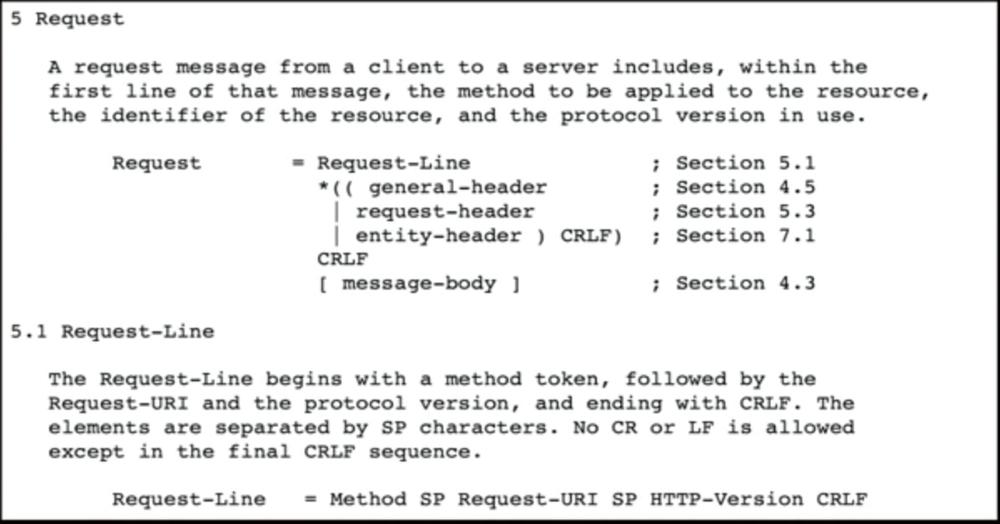
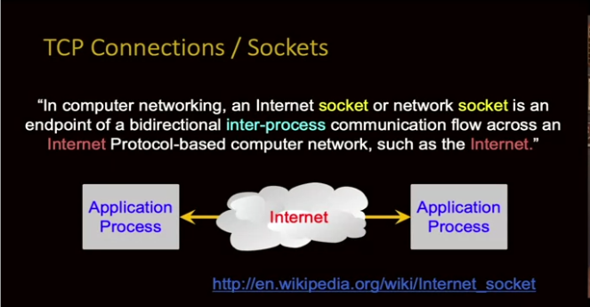
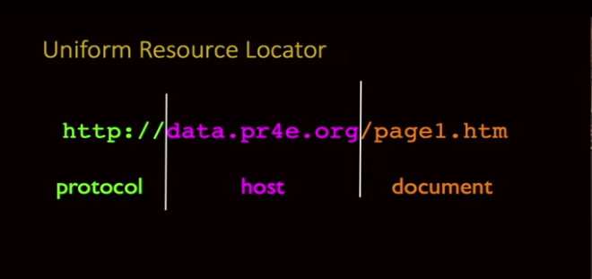
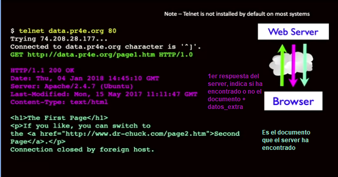
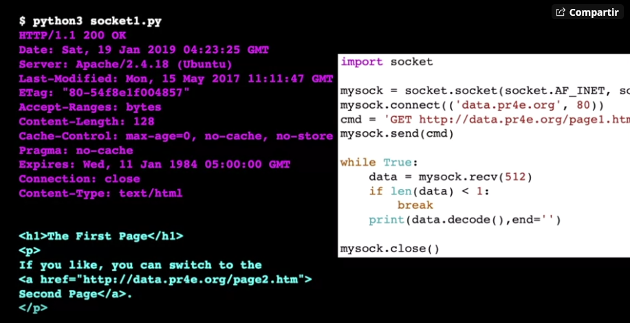

# Introducción
## ¿Por qué django?

## ¿Cómo funciona una Web Aplication?
Antes de empezar con los temas propios de Django, empezaremos por entender como funciona una aplicación web.

### Request y Respond
Si quisiéramos profundizar un poco más sobre cómo funciona el cliente y el servidor con una petición "request" tendríamos que ir a la documentación de HTTP, en donde podemos ver lo siguiente:



### Conexiones TCP / Sockets
¿Qué es un socket? 

La manera más simple de definir un socket es imaginando una llamada telefónica, en donde una persona A llama a una persona B, la persona B al contestar pregunta ¿Quién habla? a lo que la otra responde "Soy A" y una vez que se haya confirmado la identidad de ambas personas empieza el intercambio de información entre A y B. Entonces podemos entender a un socket como una llamada telefónica entre computadoras. La definicón formal de socket es la siguiente:



### Puertos TCP
Podemos verlo como una extención telefónica, en donde no tenemos una dirección fija de una aplicación, pero sí hay un puerto de comunicación fija.
Para el desarrollo de aplicaciones Web se suele trabajar con el puerto 80 para el desarrollo y una vez que la aplicación se encuentra en producción se usa el protocolo 443

### Hyper Text Transfer Protocol (HTTP)
Http es el protocolo que usan los navegadores para entablar una comunicón con los servidores. Su funcionamiento se basa en que te conectas a un servidor, averiguas dónde está, envías un solo comando con un poco de datos adicionales, se recupera algo como un documento, una imagen, datos o un HTML y finalmente se cierra la conexión.

Analizando el contenido de una URL tenemos lo siguiente:
* Protocolo: Permite el uso de múltiples protocolos, los más comunes son HTTP, HTTPS y FTP
* Host: Es el nombre del dominio, que es una forma simbólica de llegar/llamar a la dirección de un servidor
* Documento: Muestra al usuario el documento que sse ha solicitado, en este ejemplo es "page1.html"



Una vez entendido eso, veamos como se hace un Request con el protocolo HTTP
1. Conexión en el puerto 80 o 443
2. El cliente hace un primer acercamiento al servidor mediante un handshake
3. Se hace el request/petición de un documento: GET *http://www.google.com* HTTP/1.0
Notamos que se hace con el siguiente formato: *tipo_request documento datos_extra* en donde los datos_extra es cualquier información adicional que queramos que nos retorne el navegador, por ejemplo cookies

Podemos verlo de forma más gráfica en la siguiente imagen:



### Ejemplo de programa HTTP
A continuación implementaremos un pequeño programa de Python en donde podamos ver cómo funciona un navegador, cómo el navegador envía el protocolo HTTP, cómo reacciona un servidor al protocolo HTTP y finalmente cómo se devuelve un documento.

#### Cliente
Programaremos el siguiente código:

```python 
import socket

mysock = socket.socket(socket.AF_INET, socket.SOCK_STREAM)
mysock.connect(('data.pr4e.org', 80))
cmd = 'GET http://data.pr4e.org/page1.htm HTTP/1.0\r\n\r\n'.encode()
mysock.send(cmd)

while True:
    data = mysock.recv(512)
    if len(data) < 1:
        break
    print(data.decode(),end='')

mysock.close()
```
Prodecemos a analizar el código antes escrito:

Podemos ver que los sockets tienen un comportamiento muy similar a los archivos en python, primero debemos abrir el socket, la apertura del socket consta de dos pasos:
 1. Creamos el socket, que "vivirá" en nuestra computadora para mandar y recibir datos, sin embargo en este momento es un socket que no tiene un end-point definido.
`mysock = socket.socket(socket.AF_INET, socket.SOCK_STREAM)`
2. Hacemos la conexión con el servidor, le indicamos el dominio y el puerto por el que nos vamos a conectar
`mysock.connect(('data.pr4e.org', 80))`

Ahora hacemos un request, en donde indicamos el documento que queremos ver/recuperar:
`cmd = 'GET http://data.pr4e.org/page1.htm HTTP/1.0\r\n\r\n'.encode()`
Con la instrucción **enconde()** le decimos al navegador que debe de codificar la información como UTF8 y como lo analizamos anteriormente, el request consta de lo siguiente:
1. Tipo de request: *GET*
2. Documento: *http://data.pr4e.org/page1.htm*
3. Protocolo: *HTTP/1.0*
4. Datos extra: *\r\n\r\n* En este caso solo se marcan en blanco al mandarle "enter"

Una vez que hayamos terminado de escribir nuestro request, debemos de enviarlo, pues si recordamos el protocolo HTTP es el cliente quien hace el primer acercamiento con servidor mediante un handshake.
`mysock.send(cmd)`

Después esperamos la respuesta del servidor, esto lo hacemos con  un ciclo while que consiste en recibir toda la información que el servidor mande. Y mientras exista informaxión, se va a decodificar y a imprimir
```
while True:
    data = mysock.recv(512) 
    if len(data) < 1: 
        break 
    print(data.decode(),end='') 
```

Finalmente cerramos la conexión del socket
`mysock.close()`

Entonces cuando corremos este programa obtendremos una salida como la siguiente:

