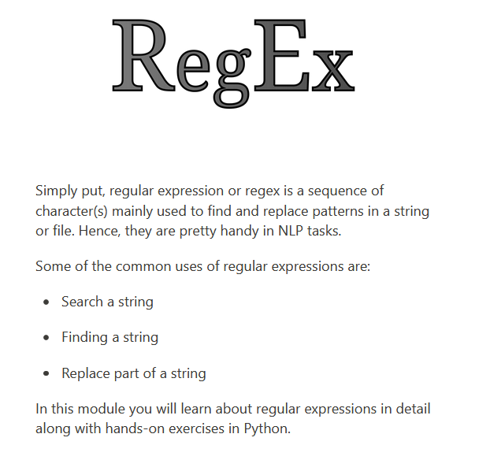
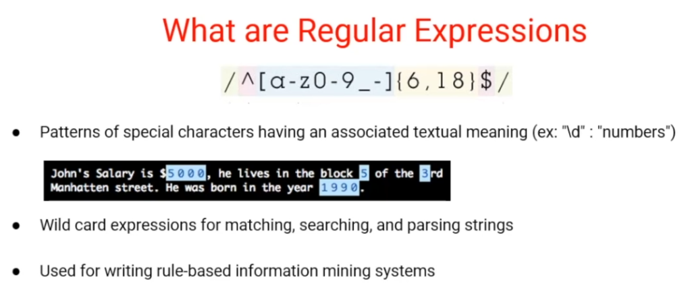
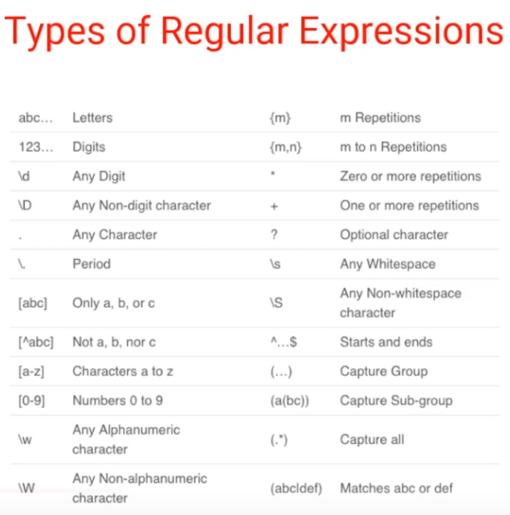
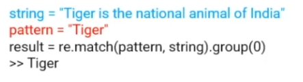
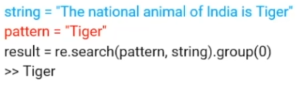
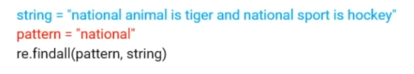
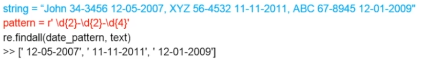
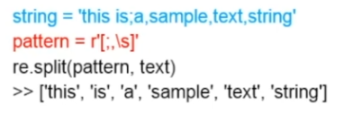
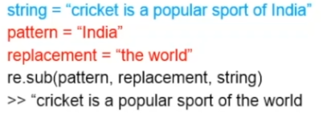

# Expresiones regulares
Una expresión regular es la secuencia de caracteres usado principalmente para encontrar o reemplazar patrones en una cadena de texto o en un archivo.



Hay algunos patrones que tienen un significado especial, por ejemplo "\d" se emplea para localizar números dentro del texto  
Comodines que nos ayudan a buscar o parsear cadenas.
También se pueden usar para escribir reglas basadas en la información de sistemas de minería de datos.



# Uso de las expresiones regualares
Uno de los usos principales de la expresiones regulares es la segmentación o extracción de palabras a partir de una oración, así como la segmentación de oraciones de párrafos. A este proceso se le conoce como "tokenization" o "tokenización".
Puede ser usado para limpiar los textos o para extraer información relevante.

# Tipos de expresiones regulares



# Funciones de expresiones regulares en python

## Definición:
* match: Busca el patrón al principio de la cadena de caracteres.
* search: Localiza el patrón en la cadena de caracteres.
* findall: Encuentra todas las ocurrencias del patrón en la cadena de caracteres.
* sub: Encuentra y reemplaza.
* split: Separa el texto.

## Implementación:
1. Importar la biblioteca "re"
```python
    import re
```

## Ejemplos de cada función:
1. Función match:

Sin embargo, si la oración fuera "The national animal of India is Tiger", nos devolvería un campo vacío, pues el patrón "Tiger" no se encuentra al principio de la oración.

2. Función search:
Si queremos buscar el patrón "Tiger" en cualquier parte de la oración, podemos usar la función search


3. Función findall:
Si queremos obtener todas las veces que aparece el patrón "national", podemos usar esta función.

Otro ejemplo:


4. Función split:
Si queremos separar todas las palabras de nuestra oración, podemos usar la función split


5. Función replacement:
Cuando queremos buscar un patrón y sustituirlo por otro, usamos la función replacement
