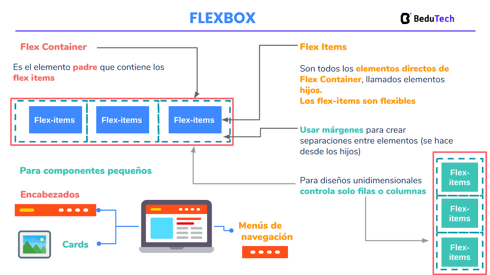

# Flexbox
## Objetivos
* Agregar contenido de video a nuestra web.
* Cambiar el posicionamiento de los elementos HTML.
* Estructurar los elementos dentro de un contenedor de manera flexible.
* Usar comandos de git para obtener cambios realizados por terceros.
* Desplegar los cambios a nuestra página web hosteada en Netlify.

## 1. Git fetch y git merge
En la sesión anterior, vimos como realizar cambios a proyectos que no somos propietarios, esto lo logramos a través de un flujo de Pull Request en Github. Debido a que estos cambios son realizados en la computadora de otras personas, es necesario realizar algunos comandos de git para obtener estas modificaciones y seguir trabajando sobre ellas en nuestro propio ordenador.

Los comandos git fetch y git merge son los comandos que usamos para obtener cambios realizados directamente en Github y que no lo tenemos en nuestro entorno de desarrollo.

git fetch es un comando que recupera todos los cambios realizados en el servidor remoto (ejemplo: Github) y que no las tenemos en nuestra computadora.

git merge por otro lado nos permite mezclar cambios de otras ramas hacia nuestra rama actual de trabajo.

## 2. Elementos media en HTML5
Elementos media hace referencia a archivos multimedia (ejemplo: audio, video) y afortunadamente al momento que lees esto los navegadores tienen soporte nativo para este tipo de recursos, pues, si en algún momento escuchaste sobre Flash o ActionScript, probablemente sabrás que era una tarea compleja obtener un recurso multimedia en la web, más aún, que sea compatible para la mayoría de navegadores sin que el usuario tenga que instalar o habilitar algo.

> Si quieres conocer un poco más acerca de la historia de multimedia en la web, [MDN](https://developer.mozilla.org/es/docs/Learn/HTML/Multimedia_and_embedding/Video_and_audio_content) nos cuenta un poco en la documentación acerca de audio y vídeo. 

Bueno, ahora que sabemos que HTML5 nos provee soporte nativo para audio y video.

**¿Cómo agregamos el vídeo a nuestra web?**

HTML5 nos provee 2 etiquetas para trabajar con audio y vídeo, sorpresivamente dichas etiquetas son: <audio></audio> y <video></video>, además a través de JavaScript (aún no veremos de esto) podemos manipular la reproducción del contenido multimedia y mejorar la experiencia que el navegador nos ofrece por defecto. Para nuestro proyecto, solo usaremos las etiquetas pero no te limitamos a que averigües sobre la interacción con JavaScript

## 3. Flexbox
Flexbox es un método disponible en CSS para alinear y estructurar visualmente el contenido de un elemento HTML. Flexbox nos permite usar la propiedad de display para indicar cuando un elemento y su contenido, en caso de tener, puede alinearse de manera flexible.

El elemento que recibe la propiedad display: flex se le conoce como flex container, mientras que a los elementos contenidos en el elemento en mención se le conoce como flex items.

Es posible controlar el posicionamiento del contenido desde el flex container aplicando propiedades de alineamiento tanto vertical como horizontal.

Cuando se define un flex container, sus elementos hijos (flex items) se modifican a ponerse uno al lado de otro, debido a que por defecto, el contenido toma una dirección de row (horizontal). La dirección se puede modificar a vertical a través de la propiedad flex-direction que se aplica al flex container.

A través de las propiedades justify-content y align-items se puede modificar el alineamiento de los hijos dependiendo de la dirección que estén siguiendo.
Ejemplo:

Si quisiéramos que los flex items estén alineados al centro horizontalmente, esto se podría lograr con justify-content: center; siempre y cuando el flex-direction sea row.

Puesto que justify-content alinea a los flex items en el eje principal, mientras que align-items lo hace en el eje secundario. Por lo tanto, notar en el ejemplo anterior que si el flex-direction fuera column (vertical) para alinear horizontalmente, necesitaríamos usar la propiedad align-items.
prueba

## 4. Position: fixed

La propiedad position con el valor de fixed es muy útil, esto debido a que esta propiedad position permite que el elemento al que se le aplica, salga del flujo normal de la web.

**Ejemplo:**

Nosotros hemos ido escribiendo etiquetas de HTML que al verse en la web solo se han puesto una debajo de otra (para los que son display: block) o al lado (para los que son display: inline), pero no hemos visto que un elemento se ponga encima de otro o en algún lugar particular sin afectar a los que los rodean.

A este comportamiento es lo que nos referimos con salir del flujo, al aplicar esta propiedad nos vamos a topar con que el contenido se pone en un lugar específico sin importarle si está afectando a otros elementos, adicional a esto, nos habilita otras propiedades para controlar su posicionamiento como top, left, bottom y right.