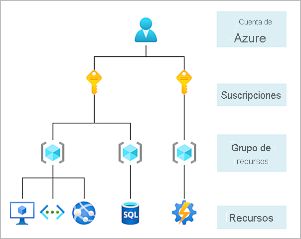

# Objetivo
En este módulo se presentan los aspectos básicos de la informática en la nube y Azure, además de una explicación sobre cómo empezar a trabajar con las suscripciones y cuentas de Azure.
Objetivos de aprendizaje

# Después de completar este módulo, podrá:
Describir los conceptos básicos de la informática en la nube.
Determinar si Azure es la solución adecuada para las necesidades empresariales.
Diferenciar entre los distintos métodos para crear una suscripción de Azure.

# Requisitos previos
Debe estar familiarizado con la terminología y los conceptos básicos relacionados con la informática.
Tener conocimientos sobre la informática en la nube es útil, pero no necesario.

# Este módulo es parte de estas rutas de aprendizaje
* Aspectos básicos de Azure, parte 1: Descripción de los conceptos básicos de Azure
* Azure para investigadores, parte 1: Introducción a la informática en la nube

# índice
1. Introducción (4 min)
2. ¿Qué es la informática en la nube? (9 min)
3. ¿Qué es Azure? (6 min)
4. Paseo por los servicios de Azure (11 min)
5. Introducción a las cuentas de Azure (2 min)
6. Introducción a un caso práctico (2 min)

---

# Introducción
Azure es una plataforma de informática en la nube con un conjunto de servicios que se amplía continuamente para ayudarle a crear soluciones que satisfagan los objetivos empresariales. Los servicios de Azure van desde servicios web sencillos para hospedar la presencia empresarial en la nube hasta la ejecución de equipos totalmente virtualizados para ejecutar soluciones de software personalizadas. Azure proporciona una gran cantidad de servicios basados en la nube, como el almacenamiento remoto, el hospedaje de bases de datos y la administración centralizada de cuentas. También ofrece nuevas funcionalidades, como inteligencia artificial e Internet de las cosas (IoT).

En este módulo, obtendrá información de un extremo a otro de nivel inicial sobre Azure y sus funcionalidades. Obtendrá una base sólida para completar las rutas de aprendizaje disponibles para los aspectos básicos de Azure.

[Video Introductorio](https://www.microsoft.com/es-mx/videoplayer/embed/RE4Ibng?postJsllMsg=true&autoCaptions=es-mx)

## ¿De qué va Aspectos básicos de Azure?
El módulo Aspectos básicos de Azure es una serie de seis rutas de aprendizaje que lo ayudan a familiarizarse con Azure y sus numerosos servicios y características.

Ya sea que esté interesado en los servicios centrales de proceso, red, almacenamiento y bases de datos de Azure, aprender sobre los procedimientos recomendados de seguridad en la nube o explorar la vanguardia en IoT y aprendizaje automático, piense en el módulo Aspectos básicos de Azure como su guía seleccionada para Azure.

Aspectos básicos de Azure incluye ejercicios interactivos que ofrecen experiencia práctica con Azure. Muchos ejercicios proporcionan un entorno temporal de Azure denominado espacio aislado, que le permite aprender de forma gratuita y a su ritmo.

No se requiere experiencia de TI técnica. Sin embargo, tener conocimientos generales de TI le ayudará a sacar el máximo partido de su experiencia de aprendizaje.

---
# ¿Qué es la informática en la nube?
¿Alguna vez se ha preguntado qué es la informática en la nube? Es la entrega de servicios informáticos a través de Internet, lo que se conoce como la nube. Estos servicios incluyen servidores, almacenamiento, bases de datos, redes, software, análisis e inteligencia. La informática en la nube ofrece una innovación más rápida, recursos flexibles y economías de escala.

[Video](https://www.microsoft.com/es-mx/videoplayer/embed/RE4LyBB?postJsllMsg=true&autoCaptions=es-mx)

## ¿Por qué suele ser más barato usar la informática en la nube?

La informática en la nube es la prestación de servicios informáticos a través de Internet mediante un modelo de precios de pago por uso. Normalmente solo se paga por los servicios en la nube que se usan, lo que permite:

* Reducir los costos operativos.
* Ejecutar la infraestructura de forma más eficaz.
* Escalar a medida que cambien las necesidades empresariales.

Dicho de otro modo, la informática en la nube es una forma de alquilar potencia de proceso y almacenamiento de un centro de datos de terceros. Los recursos de la nube se pueden tratar igual que los recursos de un centro de datos propio. Cuando haya terminado con ellos, solo hay que devolverlos. Únicamente se le cobrará por lo que use.

En lugar de mantener las CPU y el almacenamiento en un centro de datos, se alquilan durante el tiempo que sea necesario. El proveedor de nube se encarga de mantener la infraestructura subyacente por usted. La nube permite resolver rápidamente los desafíos empresariales más difíciles y proporcionar soluciones de vanguardia a los usuarios.

## ¿Por qué debería migrar a la nube?

La nube ayuda a moverse con más rapidez y a innovar de maneras que antes eran prácticamente imposibles.

En este mundo digital cambiante, surgen dos tendencias:

* Los equipos proporcionan nuevas características a los usuarios a velocidades récord.
* Los usuarios esperan una experiencia cada vez más amplia y envolvente con sus dispositivos y con el software.

Las versiones de software antes se programaban en plazos de meses o incluso años. En la actualidad, los equipos publican características en lotes más pequeños que se suelen programar en días o semanas. Algunos equipos incluso entregan actualizaciones de software de forma continua, a veces con varias versiones el mismo día.

Piense en todas las formas en que interactúa con los dispositivos y que no eran posibles hace algunos años. Muchos dispositivos pueden reconocer su cara y responder a comandos de voz. La realidad aumentada cambia la manera en que interactúa con el mundo físico. Incluso los electrodomésticos empiezan a actuar de manera inteligente. Estas tecnologías son solo algunos ejemplos, y muchas de ellas tienen tecnología de nube.

Para desarrollar los servicios y ofrecer experiencias de usuario innovadoras y novedosas más rápidamente, la nube proporciona acceso a petición para:

* Un grupo casi ilimitado de componentes de proceso, almacenamiento y redes sin procesar.
* Reconocimiento de voz y otros servicios cognitivos que ayudan a hacer que su aplicación destaque entre la multitud.
* Servicios de análisis que proporcionan datos de telemetría desde el software y los dispositivos.

---

# ¿Qué es Azure?
Azure es un conjunto de servicios en la nube en expansión constante que ayudan a la organización a cumplir los desafíos empresariales actuales y futuros. Azure le ofrece la libertad de compilar, administrar e implementar aplicaciones en una red global masiva mediante sus herramientas y plataformas favoritas.

## ¿Qué ofrece Azure?

Con la ayuda de Azure, tendrá todo lo que necesita para compilar su próxima gran solución. En la tabla siguiente se enumeran algunas de las ventajas que proporciona Azure, para que inventar con un objetivo sea más sencillo.

Esté preparado para el futuro: la innovación continua de Microsoft apoya el desarrollo actual y los proyectos de productos para el futuro.

Cree a su ritmo: Tiene opciones. Si mantiene un compromiso con el código abierto y admite todos los lenguajes y marcos, puede compilar como quiera e implementar donde quiera.

Opere en el entorno híbrido sin problemas: ya sea en el entorno local, en la nube o en el entorno perimetral, le apoyaremos donde esté. Integre y administre los entornos con herramientas y servicios diseñados para una solución de nube híbrida.

Confíe en la nube: obtenga seguridad desde el principio, respaldada por un equipo de expertos, y un cumplimiento proactivo de confianza para las empresas consolidadas, los gobiernos y las nuevas empresas.

## ¿Qué puedo hacer con Azure?

Azure proporciona más de cien servicios que permiten hacer todo tipo de cosas: desde ejecutar las aplicaciones existentes en máquinas virtuales hasta explorar nuevos paradigmas de software, como bots inteligentes y realidad mixta.

Muchos equipos comienzan a explorar la nube mediante la migración de sus aplicaciones existentes a máquinas virtuales que se ejecutan en Azure. Si bien este es un buen comienzo, la nube es mucho más que "un lugar diferente donde ejecutar las máquinas virtuales".

Por ejemplo, Azure proporciona servicios de inteligencia artificial y aprendizaje automático que pueden comunicarse naturalmente con los usuarios mediante la vista, el oído y la voz. También facilita soluciones de almacenamiento que crecen dinámicamente para dar cabida a grandes cantidades de datos. Los servicios de Azure permiten soluciones que no son factibles sin la potencia de la nube.

## ¿Cómo funciona Azure?
[Video](https://www.microsoft.com/es-mx/videoplayer/embed/RWlzQ6?postJsllMsg=true&autoCaptions=es-mx)

## ¿Qué es Azure Portal?

Azure Portal es una consola unificada basada en web que proporciona una alternativa a las herramientas de línea de comandos. Con Azure Portal, puede administrar la suscripción de Azure mediante una interfaz gráfica de usuario. Puede:

* Compile, administre y supervise todo, desde aplicaciones web sencillas hasta complejas implementaciones en la nube.
* Cree paneles personalizados para una vista organizada de recursos.
* Configure opciones de accesibilidad para una experiencia óptima.

[Video](https://www.microsoft.com/es-mx/videoplayer/embed/RE4ICN6?postJsllMsg=true&autoCaptions=es-mx)

Azure Portal está diseñado para proporcionar resistencia y disponibilidad continua. Mantiene una presencia en todos los centros de datos de Azure. Esta configuración hace que Azure Portal sea resistente a los errores de centros de datos individuales y evita que se ralentice la red al estar cerca de los usuarios. Azure Portal no deja de actualizarse y no requiere tiempo de inactividad para las actividades de mantenimiento.

## ¿Qué es Azure Marketplace?

[Azure Marketplace](https://azuremarketplace.microsoft.com/es-MX/) facilita la conexión entre los usuarios y los partners de Microsoft, proveedores de software independientes y nuevas empresas que ofrecen sus soluciones y servicios, optimizados para ejecutarse en Azure. Los clientes de Azure Marketplace pueden buscar, probar, comprar y aprovisionar aplicaciones y servicios de cientos de los principales proveedores de servicios. Todas las soluciones y los servicios están certificados para ejecutarse en Azure.

El catálogo de soluciones abarca varias categorías del sector, como plataformas de contenedores de código abierto, imágenes de máquina virtual, bases de datos, software de compilación e implementación de aplicaciones, herramientas para desarrolladores, detección de amenazas y cadena de bloques. Con Azure Marketplace, puede aprovisionar soluciones integrales de forma rápida y confiable, hospedadas en su propio entorno de Azure. En el momento de escribir este documento, hay más de 8000 entradas.

Azure Marketplace está diseñado para profesionales de TI y desarrolladores en la nube interesados en el software comercial y de TI. Los partners de Microsoft también lo usan como punto de inicio de todas las actividades de comercialización conjunta.

---

# Paseo por los servicios de Azure
Azure puede ayudarle a afrontar complicados retos empresariales. Usted pone los requisitos, la creatividad y sus herramientas de desarrollo de software favoritas. Azure le ofrece una gran infraestructura global que siempre está disponible para compilar aplicaciones.

Se realizará un recorrido rápido por los servicios generales que ofrece Azure.

## Introducción a Azure
[Video](https://www.microsoft.com/es-mx/videoplayer/embed/RWBg9Q?postJsllMsg=true&autoCaptions=es-mx)

## Servicios de Azure

Aquí tiene una vista general de los servicios y características disponibles de Azure.

Ahora se verán con más detalle las categorías que se usan con más frecuencia:

* Proceso
* Redes
* Almacenamiento
* Móvil
* Bases de datos
* Web
* Internet de las cosas (IoT)
* Macrodatos
* INTELIGENCIA ARTIFICIAL
* DevOps

## Proceso

Los servicios de proceso a menudo son una de las razones principales de por qué las compañías se cambian a la plataforma Azure. Azure proporciona una amplia gama de opciones para hospedar aplicaciones y servicios. Estos son algunos ejemplos de servicios de proceso en Azure.

* Azure Virtual Machines: Máquinas virtuales (VM) Windows o Linux hospedadas en Azure.
* Azure Virtual Machine Scale Sets: Escalado de máquinas virtuales Windows o Linux hospedadas en Azure.
* Azure Kubernetes Service: Administración de clústeres para máquinas virtuales que ejecutan servicios en contenedores.
* Azure Service Fabric: Plataforma de sistemas distribuidos que se ejecuta en Azure o en el entorno local.
* Azure Batch: Servicio administrado para aplicaciones informáticas de alto rendimiento y paralelas.
* Azure Container Instances: Aplicaciones en contenedores que se ejecutan en Azure sin necesidad de aprovisionar servidores ni máquinas virtuales.
* Azure Functions: Un servicio de procesos sin servidor y controlado por eventos

## Redes

La vinculación de recursos de proceso y el suministro de acceso a las aplicaciones es la función clave de la red de Azure. La funcionalidad de red de Azure incluye una gama de opciones para conectar el mundo exterior a servicios y características de los centros de datos globales de Azure.

Estos son algunos ejemplos de los servicios de red de Azure.

* Azure Virtual Network: Conecta máquinas virtuales a conexiones de red privada virtual (VPN) entrantes.
* Azure Load Balancer: Equilibra las conexiones entrantes y salientes a aplicaciones o puntos de conexión de servicio.
* Azure Application Gateway: Optimiza la entrega de granjas de servidores de aplicaciones y, al mismo tiempo, aumenta la seguridad de las aplicaciones.
* Azure VPN Gateway: Accede a redes de Azure Virtual Network mediante puertas de enlace de VPN de alto rendimiento.
* Azure DNS: Proporciona respuestas DNS ultrarrápidas y disponibilidad de dominio extremadamente alta.
* Azure Content Delivery Network: Entrega contenido de gran ancho de banda a los clientes globalmente.
* Azure DDoS Protection: Protege las aplicaciones hospedadas en Azure frente a ataques por denegación de servicio distribuido (DDoS).
* Azure Traffic Manager: Distribuye el tráfico de red entre las regiones de Azure en todo el mundo.
* Azure ExpressRoute: Se conecta a Azure mediante conexiones seguras de gran ancho de banda dedicadas.
* Azure Network Watcher: Supervisa y diagnostica problemas de red mediante el análisis basado en el escenario.
* Azure Firewall: Implementa un firewall de alta seguridad y alta disponibilidad con escalabilidad ilimitada.
* Azure Virtual WAN: Crea una red de área extensa (WAN) unificada que conecta sitios locales y remotos.

## Almacenamiento

Azure proporciona cuatro tipos principales de servicios de almacenamiento.

* Azure Blob Storage: Servicio de almacenamiento para objetos muy grandes, como archivos de vídeo o mapas de bits.
* Azure File storage: Recursos compartidos de archivos que puede administrar como un servidor de archivos y acceder a ellos del mismo modo.
* Azure Queue Storage: Almacén de datos para la puesta en cola y la entrega confiable de mensajes entre aplicaciones.
* Azure Table storage: Table Storage es un servicio que almacena datos estructurados no relacionales (también conocidos como datos NoSQL estructurados) en la nube, lo que proporciona un almacén de claves y atributos con un diseño sin esquema.

Todos estos servicios comparten varias características: 
* Durabilidad y alta disponibilidad con redundancia y la replicación.
* Seguridad mediante el cifrado automático y control de acceso basado en rol.
* Escalabilidad con un almacenamiento prácticamente ilimitado.
* Administración y control del mantenimiento y de cualquier problema crítico que pueda surgir.
* Accesibilidad desde cualquier parte del mundo a través de HTTP o HTTPS.

## Móvil

Con Azure, los desarrolladores pueden crear servicios de back-end móviles para aplicaciones iOS, Android y Windows de forma rápida y sencilla. Las características que solían tardar tiempo y aumentaban los riesgos del proyecto, como la incorporación del inicio de sesión corporativo y la posterior conexión a recursos locales como SAP, Oracle, SQL Server y SharePoint, ahora se incluyen con facilidad.

Estas son otras características de este servicio:

* Sincronización de datos sin conexión.
* Conectividad a datos locales.
* Difusión de notificaciones de inserción.
* Escalado automático para satisfacer las necesidades del negocio.

## Bases de datos

Azure proporciona varios servicios de base de datos para almacenar una gran variedad de volúmenes y tipos de datos. Y con la conectividad global, los usuarios disponen de estos datos al instante.

* Azure Cosmos DB: Base de datos distribuida globalmente que admite opciones NoSQL.
* Azure SQL Database: Base de datos relacional totalmente administrada con escalado automático, inteligencia integral y seguridad sólida.
* Azure Database for MySQL: Base de datos relacional MySQL totalmente administrada y escalable con alta disponibilidad y seguridad.
* Azure Database for PostgreSQL: Base de datos relacional PostgreSQL totalmente administrada y escalable con alta disponibilidad y seguridad.
* SQL Server en Azure Virtual Machines: Servicio que hospeda aplicaciones empresariales de SQL Server en la nube.
* Azure Synapse Analytics: Almacén de datos totalmente administrado con seguridad integral en todos los niveles de escala sin costo adicional.
* Azure Database Migration Service: Servicio que migra bases de datos a la nube sin cambios en el código de aplicación.
* Azure Cache for Redis: Servicio totalmente administrado que almacena en caché datos estáticos y usados con frecuencia para reducir la latencia de datos y aplicaciones.
* Azure Database for MariaDB: Base de datos relacional MariaDB totalmente administrada y escalable con alta disponibilidad y seguridad.

## Web

En el mundo empresarial actual es fundamental tener una experiencia web excelente. Azure incluye soporte técnico de primera clase para compilar y hospedar aplicaciones web y servicios web basados en HTTP. Los siguientes servicios de Azure se centran en el hospedaje web.

* Azure App Service: Creación rápida de aplicaciones en la nube eficaces basadas en web.
* Azure Notification Hubs: Envíe notificaciones push a cualquier plataforma desde cualquier back-end.
* Azure API Management: Publique API para desarrolladores, asociados y empleados de forma segura y a escala.
* Azure Cognitive Search: Esta búsqueda completamente administrada se implementa como servicio.
* Característica Web Apps de Azure App Service: Cree e implemente rápidamente aplicaciones web críticas a escala.
* Servicio Azure SignalR: Agregue funcionalidades web en tiempo real con facilidad.

## IoT

Los usuarios pueden tener acceso a más información que nunca. Los asistentes digitales personales llevaron a los smartphones y ahora existen relojes inteligentes, termostatos inteligentes e incluso frigoríficos inteligentes. Los equipos estaban a la orden del día. Ahora, Internet permite que cualquier objeto capaz de conectarse tenga acceso a valiosa información. Esta capacidad de los dispositivos de obtener y luego retransmitir información para el análisis de datos se conoce como IoT (Internet de las cosas).

Muchos servicios pueden ayudar e impulsar soluciones de un extremo a otro para IoT en Azure.

* IoT Central: Solución global de software como servicio (SaaS) de IoT totalmente administrada que facilita la conexión, la supervisión y la administración de los recursos de IoT a escala.
* Azure IoT Hub: Centro de mensajería que proporciona comunicaciones y supervisión seguras entre millones de dispositivos de IoT.
* IoT Edge: Servicio totalmente administrado que permite insertar los modelos de análisis de datos directamente en los dispositivos IoT, lo que les permite responder rápidamente a los cambios de estado sin necesidad de consultar modelos de IA basados en la nube.

# Macrodatos

Los datos se presentan en cualquier formato y tamaño. Cuando hablamos sobre macrodatos, nos referimos a grandes volúmenes de datos. Los datos de los sistemas del tiempo, sistemas de comunicaciones, investigación genómica, plataformas de imágenes y muchos otros escenarios generan cientos de gigabytes de datos. Esta cantidad de datos hace que resulte difícil analizar y tomar decisiones. A menudo es tan grande que las formas de procesamiento y análisis tradicionales ya no son adecuadas.

Se han desarrollado tecnologías de clúster de código abierto para tratar con estos grandes conjuntos de datos. Azure admite una amplia gama de tecnologías y servicios para proporcionar soluciones de análisis y macrodatos.

* Azure Synapse Analytics: Ejecute análisis a gran escala mediante un almacenamiento de datos empresarial basado en la nube que aprovecha las ventajas del procesamiento paralelo masivo para ejecutar rápidamente consultas complejas en petabytes de datos.
* HDInsight de Azure: Procese grandes cantidades de datos con los clústeres administrados de Hadoop en la nube.
* Azure Databricks: Integre este servicio de análisis colaborativo basado en Apache Spark con otros servicios de macrodatos en Azure.

## INTELIGENCIA ARTIFICIAL

En el contexto de la informática en la nube, la inteligencia artificial se basa en una amplia gama de servicios, donde el principal es el aprendizaje automático. El aprendizaje automático es una técnica de ciencia de datos que permite a los equipos utilizar datos existentes para prever tendencias, resultados y comportamientos futuros. Mediante el aprendizaje automático, los equipos aprenden sin necesidad de programarlos explícitamente.

Las previsiones o predicciones del aprendizaje automático pueden hacer que las aplicaciones y los dispositivos sean más inteligentes. Por ejemplo, al comprar en línea, el aprendizaje automático le recomienda otros productos que le pueden gustar según lo que haya comprado. O bien, al pasar la tarjeta de crédito, el aprendizaje automático compara la transacción con una base de datos de transacciones y ayuda a detectar fraudes. Y cuando la aspiradora robot aspira una sala, el aprendizaje automático le ayuda a decidir si se ha terminado el trabajo.

Estos son algunos de los tipos de servicios de inteligencia artificial y aprendizaje automático más comunes de Azure.

* Azure Machine Learning Service: Entorno basado en la nube que puede usar para desarrollar, entrenar, probar, implementar, administrar y realizar un seguimiento de los modelos de aprendizaje automático. Puede generar y ajustar automáticamente un modelo. Le permite comenzar a entrenar en el equipo local y luego escalar horizontalmente a la nube.

* Azure ML Studio: Área de trabajo visual colaborativa donde puede compilar, probar e implementar soluciones de aprendizaje automático mediante algoritmos de aprendizaje automático predefinidos y módulos de control de datos.

**Cognitive Services** es un conjunto de productos estrechamente relacionados. Puede usar estas API precompiladas en las aplicaciones para solucionar problemas complejos.

* Visión: Use algoritmos de procesamiento de imágenes para identificar, subtitular, indexar y moderar imágenes y vídeos.
* Voz: Convierta voz en texto, use la voz para la comprobación o agregue reconocimiento del hablante a la aplicación.
* Asignación de conocimiento: Asigne información y datos complejos para resolver tareas como las de recomendaciones inteligentes y búsqueda semántica.
* Bing Search: Agregue las Bing Search API a sus aplicaciones y aproveche la capacidad de combinar miles de millones de páginas web, imágenes, vídeos y noticias con una sola llamada API.
* Procesamiento de lenguaje natural: permita que las aplicaciones procesen lenguaje natural con scripts precompilados, evalúen opiniones y aprendan a reconocer lo que quieren los usuarios.

## DevOps

DevOps reúne a individuos, procesos y tecnología mediante la automatización de la entrega de software para ofrecer un valor continuo a los usuarios. Con Azure DevOps puede crear, compilar y publicar canalizaciones que proporcionan integración, entrega e implementación continuas a las aplicaciones. Puede integrar los repositorios y las pruebas de aplicaciones, realizar la supervisión de aplicaciones y trabajar con artefactos de compilación. También puede trabajar con elementos de trabajo pendiente para realizar el seguimiento, automatizar la implementación de la infraestructura e integrar una gama de herramientas y servicios de terceros como Jenkins y Chef. Todas estas funciones y muchas más están estrechamente integradas con Azure para permitir implementaciones coherentes y reproducibles para que las aplicaciones proporcionen unos procesos de compilación y lanzamiento optimizados.

* Azure DevOps: Use herramientas de colaboración de desarrollo como canalizaciones de alto rendimiento, repositorios Git privados gratuitos, paneles Kanban configurables y completas pruebas de carga basadas en la nube y automatizadas. Anteriormente conocido como Visual Studio Team Services.
* Azure DevTest Labs: Cree rápidamente entornos de Windows y Linux a petición para probar o realizar demostraciones de las aplicaciones directamente desde canalizaciones de implementación.

---

# Introducción a las cuentas de Azure
Para crear y usar los servicios de Azure, necesita una suscripción de Azure. Al completar los módulos de Microsoft Learn, la mayoría de las veces se crea una suscripción temporal de forma automática, que se ejecuta en un entorno denominado espacio aislado de Microsoft Learn. Cuando trabaje con aplicaciones y necesidades empresariales propias, tendrá que crear una cuenta de Azure y se creará una suscripción de forma automática. Después de crear una cuenta de Azure, puede crear suscripciones adicionales. Por ejemplo, es posible que la empresa use una única cuenta de Azure para el negocio y suscripciones independientes para los departamentos de desarrollo, marketing y ventas. Una vez que ha creado una suscripción de Azure, puede empezar a crear recursos de Azure dentro de cada suscripción.

Si no está familiarizado con Azure, puede registrarse para obtener una cuenta gratuita en el [sitio web de Azure](https://azure.microsoft.com/es-mx/) y, de este modo, empezar a explorar sin coste alguno. Cuando esté listo, puede optar por actualizar la cuenta gratuita. Puede crear una suscripción que le permita comenzar a pagar por los servicios de Azure que necesita usar y a los que no puede acceder mediante una cuenta gratuita.

## Crear una cuenta de Azure

Puede comprar el acceso a Azure directamente desde Microsoft, si se registra en el sitio web de Azure, o bien a través de un representante de Microsoft. También puede comprar el acceso a Azure a través de un partner de Microsoft. Los partners del programa Proveedor de soluciones en la nube ofrecen una amplia gama de soluciones en la nube administradas y completas para Azure.

Para obtener más información sobre cómo crear una cuenta de Azure, vea el módulo de aprendizaje [Creación de una cuenta de Azure](https://docs.microsoft.com/es-es/learn/modules/create-an-azure-account/).

## ¿Qué es la cuenta gratuita de Azure?

La cuenta gratuita de Azure incluye lo siguiente:

* Acceso gratuito a productos populares de Azure durante 12 meses.
* Crédito para gastar durante los primeros 30 días.
* Acceso a más de 25 productos que siempre son gratuitos.

La cuenta gratuita de Azure es una manera excelente para que los nuevos usuarios empiecen y exploren. Para registrarse, necesita un número de teléfono, una tarjeta de crédito y una cuenta de Microsoft o de GitHub. La información de la tarjeta de crédito solo se usa para la verificación de identidad. No se le cobrará por ningún servicio hasta que actualice a una suscripción de pago.

## ¿Qué es la cuenta de estudiante gratuita de Azure?

La oferta de la [cuenta de estudiante](https://azure.microsoft.com/es-mx/free/students/) gratuita de Azure incluye lo siguiente:

* Acceso gratuito a determinados servicios de Azure durante 12 meses.
* Un crédito para usar en los primeros 12 meses.
* Acceso gratuito a determinadas herramientas de desarrollo de software.

La cuenta de estudiante gratuita de Azure es una oferta para estudiantes que ofrece 100 USD de crédito y herramientas de desarrollo gratuitas. Además, puede registrarse sin tarjeta de crédito.

## ¿Qué es el espacio aislado de Azure?

En muchos de los ejercicios de Learn se usa una tecnología denominada espacio aislado, que crea una suscripción temporal que se agrega a la cuenta de Azure. Esta suscripción temporal le permite crear recursos de Azure para la duración de un módulo de Learn. Learn limpia de forma automática los recursos temporales una vez que haya completado el módulo.

Cuando complete un módulo de Learn, puede usar la suscripción personal para finalizar los ejercicios que incluye. Pero el espacio aislado es el método preferido para usar, ya que permite crear y probar recursos de Azure sin costo alguno.

---

# Introducción a un caso práctico
A lo largo de las rutas de aprendizaje Aspectos básicos de Azure, trabajará con Tailwind Traders, un distribuidor ficticio de mejoras para el hogar. Esta empresa cuenta con ferreterías minoristas en todo el mundo y en línea.

En la actualidad, Tailwind Traders administra un centro de datos local en el que se hospeda el sitio web comercial de la empresa. En el centro de datos también se almacenan todos los datos y vídeos de streaming para sus aplicaciones. Actualmente, el departamento de TI es responsable de todas las tareas de administración de su hardware y software informáticos. Por ejemplo, imagine que trabaja como especialista de TI para el departamento de TI de la empresa. El equipo de TI controla el proceso de adquisición de nuevo hardware, instala y configura software y realiza todas las implementaciones en el centro de datos.

Estas responsabilidades de administración generan varios obstáculos a la hora de proporcionar las aplicaciones a los usuarios de manera oportuna. Como profesional de TI, observa que sería ventajoso tener los servidores, el almacenamiento, las bases de datos y los demás servicios disponibles de inmediato al desarrollar e implementar aplicaciones. Quiere iniciar fácilmente un nuevo servidor o agregar servicios a las soluciones.

En las demás unidades de este módulo de aprendizaje, ha obtenido información sobre algunos de los servicios basados en la nube que Tailwind Traders puede usar para abordar sus desafíos tecnológicos. Teniendo esto en cuenta, los servicios que están disponibles a través de Azure pueden ayudar a Tailwind Traders a desarrollar su negocio de forma más eficaz.

A medida que complete los distintos módulos de las rutas de aprendizaje de Aspectos básicos de Azure, se analizarán los desafíos a los que se enfrenta Tailwind Traders. Verá cómo puede usar los servicios de Azure para solucionar cada uno de esos problemas a medida que surgen. Una vez que haya completado cada uno de los módulos, los conocimientos que ha adquirido al resolver los desafíos hipotéticos a los que se enfrentaba la empresa ficticia Tailwind Traders deberían ayudarle en los entornos reales.