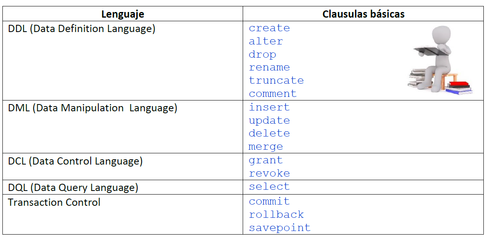

# Características principales de SQL
De estructura sencilla, fácil de entender, al ser un lenguaje de alto nivel.
* Diseñado para trabajar con conjunto de datos.
* No procedimental.
* Portable. Existencia de estándares regulados que permiten el uso del lenguaje relativamente independiente al manejador que se utilice.
* Existencia de extensiones empleadas para evitar los problemas que implica la falta se sentencias de control y estructuras que proporciona un lenguaje procedimental. En este caso cada manejador define sus propias extensiones del SQL:
    * PL-SQL en Oracle
    * Transact SQL en SQL Server (Microsoft)
    * SQL-PL En DB2 (IBM)

# Categorías de SQL
El lenguaje SQL está dividido en diversas categorías clasificadas con base a su uso:
### DDL (Data Definition Language)
Lenguaje de definición de datos. Es el lenguaje encargado de la creación, modificación y eliminación de la estructura de los objetos de la base de datos (tablas, índices, vistas, etc).

### DML (Data Manipulation Language)
Lenguaje de manipulación de datos. Es el lenguaje que permite realizar las tareas de consulta, modificación y eliminación de los datos almacenados en una base de datos.

### DCL (Data Control Language)
Lenguaje de control de datos. Es el lenguaje encargado de configurar y establecer el control de acceso a la base de datos. Incluye instrucciones para definir accesos y privilegios a los distintos objetos de la base de datos.

### DQL (Data Query Language)
Lenguaje de consulta de datos. Algunos autores clasifican a la instrucción SELECT como el único elemento de una cuarta categoría del lenguaje SQL Data Query Language (DQL).

#### Transaction Control
Control de transacciones. Es el lenguaje empleado para crear, y administrar transacciones aplicadas a un conjunto de sentencias DML principalmente.

