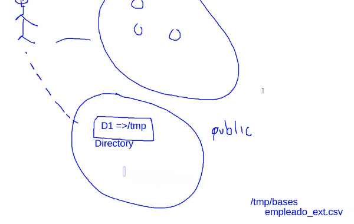

# Creación de tablas
En Oracle es posible crear 2 categorías de tablas principales:
*   Relational tables. Representa la estructura básica (formato tabular) para almacenar datos.
*   Object tables. Los tipos de datos de cada columna son tipos de datos personalizados: Object data types. Para efectos del curso, se revisan solo tablas relacionales. Por ejemplo un tipo de dato "Persona" cuyos atributos sean "nombre" y "apellidos" del tipo varchar.

La sintaxis general para crear una tabla es la siguiente
```sql
create [ global temporary] table [< schema >.]<table_name>(
    <column_name>{
        [ 
            <datatype>[<size1>[, <size2>]] [default <default_value>] [encrypt <encryption_specs>] [<column_constraint>, ...] 
        ] 
        | as < expression > virtual, ... [<table_or_column_constraint>, ...] [physical_properties>]
    } 
) [on commit {delete | preserve} rows]
```

Por ejemplo vamos a crear una tabla sencilla:
```sql
create table empleado_simple(
    empleado_id number(10,0) not null,
    nombre varchar2(40) not null
);
```
Cuando creamos unn atribut por defecto es nulo, por eso si no queremos que sea nulo debemos de especificarlo. Por buenas prácticas al final se debe crear un comentario que haga alusión a la función de dicha tabla, de esta forma las tablas quedan documentadas
```sql
comment on table empleado_simple is 'Mi primera tabla de empleados';
```
# Organización de almacenamiento
En Oracle, el almacenamiento de los datos puede organizarse con las siguientes características:
* **Ordinarias (Heap organized table):** Representa el tipo más común en el que los registros no se guardan en algún orden el particular. La tabla creada anteriormente representa una tabla de este tipo.
* **Indexadas (Indexed- organized tables):** Los registros se ordenan con base a los valores de la PK. (Normalmente no se usa mucho esta opción)
* **Tablas externas:** Son tablas de solo **lectura** y todas sus columnas deben de ser **nulas**. La definición de su estructura o metadatos son almacenados en el diccionario de datos, pero los datos se encuentran en una fuente externa a la base de datos, por ejemplo, en archivos de texto: archivos CSV, etc. Las ventajas de este tipo de tablas es que nos permite analizar datos externos a las bd y que podemos hacer op tipo join y combinarlos con datos de la bd.

Las instrucciones que nos permiten crear una tabla externa es la siguiente:
```sql
--Se requiere del usuario SYS para crear un objeto tipo --directory y otorgar privilegios. 
prompt Conectando como sys 
connect sys as sysdba

--Un objeto tipo directory es un objeto que se crea y almacena en el diccionario de datos y se emplea para mapear directorios reales en el sistema de archivos. En este caso tmp_dir es un objeto que apunta al directorio /tmp/bases del servidor
prompt creando directorio tmp_dir
create or replace directory tmp_dir as '/tmp/bases'; 

--Se otorgan permisos para que el usuario jorge0507 de la BD pueda leer el contenido del directorio
grant read, write on directory tmp_dir to jorge0507;
```
Nótese que el **"directory"** que estamos creando NO es un directorio del SO
Recordemos que cada usuario tiene asignado un esquema que a su vez está lleno de objetos, hay un tipo de objetos que son comunes a los esquemas, esto quiere decir que varios usuarios pueden acceder a esos objetos si es que tienen los privilegios necesarios. 
En realidad el objeto directory es una especie de mapeo, pues es una cadena que apunta hacia una ruta del SO donde se ubica el servidor.

Entonces la idea de este código es que generemos un objeto de tipo "directory" que apunte al directorio del SO "/tmp/bases" y almacene los datos del archivo "empleado_ext.csv"


```sql
prompt Contectando con usuario jorge0507 para crear la tabla externa
connect jorge0507

prompt creando tabla externa
create table empleado_ext (
    num_empleado number(10, 0),
    nombre varchar2(40),
    ap_paterno varchar2(40), 
    ap_materno varchar2(40), 
    fecha_nacimiento date 
) 

organization external (
--En oracle existen 2 tipos de drivers para parsear el archivo: -- oracle_loader y oracle_datapump
    type oracle_loader 
    default directory tmp_dir 
    access parameters ( 
        records delimited by newline 
        badfile tmp_dir:'empleado_ext_bad.log' 
        logfile tmp_dir:'empleado_ext.log' 
        fields terminated by ',' 
        lrtrim 
        missing field values are null (
            num_empleado, nombre, ap_paterno, ap_materno,
            fecha_nacimiento date mask "dd/mm/yyyy" 
        )
    )
    location ('empleado_ext.csv') 
) reject limit unlimited;

--Dentro de sqlplus se pueden ejecutar comandos del s.o. empleando '!' 
-- En esta instrucción se crea el directorio /tmp/bases para copiar el archivo csv 
prompt creando el directorio /tmp/bases en caso de no existir 
!mkdir -p /tmp/bases 

-- Asegurarse que el archivo csv se encuentra en elmismo directorio donde se está ejecutando este script. De lo contrario, el comando cp fallará. 
prompt copiando el archivo csv a /tmp/bases 
!cp empleado_ext.csv /tmp/bases

prompt cambiando permisos 
!chmod 777 /tmp/bases 

prompt mostrando los datos 
col nombre format a20 
col ap_paterno format a20 
col ap_materno format a20 

select * from empleado_ext;
```
