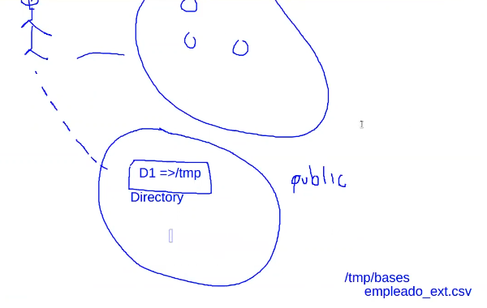

# Tablas externas
Las instrucciones que nos permiten crear una tabla externa es la siguiente:
```sql
--Se requiere del usuario SYS para crear un objeto tipo --directory y otorgar privilegios. 
prompt Conectando como sys 
connect sys as sysdba

--Un objeto tipo directory es un objeto que se crea y almacena en el diccionario de datos y se emplea para mapear 
-- directorios reales en el sistema de archivos. En este caso tmp_dir es un objeto que apunta al directorio
-- /tmp/bases del servidor
prompt creando directorio tmp_dir
create or replace directory tmp_dir as '/tmp/bases'; 

--Se otorgan permisos de lectura para que el usuario jorge0507 de la BD pueda leer el contenido del directorio
grant read on directory tmp_dir to jorge0507;
```
Nótese que el **"directory"** que estamos creando NO es un directorio del SO
Recordemos que cada usuario tiene asignado un esquema que a su vez está lleno de objetos, hay un tipo de objetos que son comunes a los esquemas, esto quiere decir que varios usuarios pueden acceder a esos objetos si es que tienen los privilegios necesarios. 
En realidad el objeto directory es una especie de mapeo, pues es una cadena que apunta hacia una ruta del SO donde se ubica el servidor.

Entonces la idea de este código es que generemos un objeto de tipo "directory" que apunte al directorio del SO "/tmp/bases" y almacene los datos del archivo "empleado_ext.csv"


```sql
prompt Contectando con usuario jorge0507 para crear la tabla externa
connect jorge0507

prompt creando tabla externa
create table empleado_ext (
    num_empleado number(10, 0),
    nombre varchar2(40),
    ap_paterno varchar2(40), 
    ap_materno varchar2(40), 
    fecha_nacimiento date 
) 

--En oracle existen 2 tipos de drivers para parsear el archivo: 
-- oracle_loader y oracle_datapump
organization external (
    type oracle_loader 
    default directory tmp_dir 
    access parameters ( 
        records delimited by newline 
        badfile tmp_dir:'empleado_ext_bad.log' 
        logfile tmp_dir:'empleado_ext.log' 
        fields terminated by ',' 
        lrtrim 
        missing field values are null (
            num_empleado, nombre, ap_paterno, ap_materno,
            fecha_nacimiento date mask "dd/mm/yyyy" 
        )
    )
    location ('empleado_ext.csv') 
) reject limit unlimited;

--Dentro de sqlplus se pueden ejecutar comandos del s.o. empleando '!' 
-- En esta instrucción se crea el directorio /tmp/bases para copiar el archivo csv 
prompt creando el directorio /tmp/bases en caso de no existir 
!mkdir -p /tmp/bases 

-- Asegurarse que el archivo csv se encuentra en elmismo directorio donde se está ejecutando este script.
-- De lo contrario, el comando cp fallará. 
prompt copiando el archivo csv a /tmp/bases 
!cp empleado_ext.csv /tmp/bases

prompt cambiando permisos 
!chmod 777 /tmp/bases 

prompt mostrando los datos 
col nombre format a20 
col ap_paterno format a20 
col ap_materno format a20 

select * from empleado_ext;
```

Debemos de observar lo siguiente:
* La sección access parameters. Aquí se especifican las configuraciones necesarias para acceder al archivo csv.
* Los campos badfile y logfile especifican los nombres de los archivos que contienen información acerca del resultado del parseo del archivo. En el archivo empleado_ext_bad.log se guardan los registros que no pudieron ser parseados de forma correcta. En el archivo empleado_ext.log se guardan mensajes generales del proceso de parseo. Ambos archivos se guardarán en el directorio tmp_dir, el cual apunta a /tmp/bases
* La lista de atributos que se especifican entre paréntesis. Esta lista corresponde con la lista de atributos de la tabla externa. El orden corresponde con el orden del archivo csv.
* El valor del atributo location. Aquí se especifica el nombre del archivo que contiene los datos (datos externos a la base de datos). En este ejemplo el archivo es empleado_ext.csv
* Notar que la tabla externa se crea sin importar si existe o no el archivo de datos. La validación se realiza hasta que se hace una consulta.
* Finalmente, la instrucción reject limit unlimited es empleada para validar el número máximo de errores que pueden ocurrir al leer el contenido del archivo csv. Si se excede del valor configurado, toda la instrucción se considera como fallida. En este caso se especifica el valor unlimited. Esto significa que se intentará leer todos los renglones del archivo sin importar el número de errores que se hayan encontrado.

___
Nota: Página 10, tema 7 parte 1. Clase #27
___