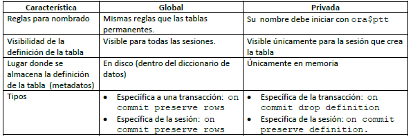

# Tablas temporales
Una tabla temporal contiene datos que existen únicamente durante la existencia de una transacción o de una sesión.
* Los datos de una tabla temporal son privados a cada sesión de usuario. Si un usuario se conecta a la base de datos en 2 sesiones diferentes, la sesión 1 no podrá ver los datos que inserta o actualiza la otra sesión.

Existen 2 tipos de tablas temporales:
* Global temporary table
* Private temporary table.

La siguiente tabla muestra sus características y diferencias.

